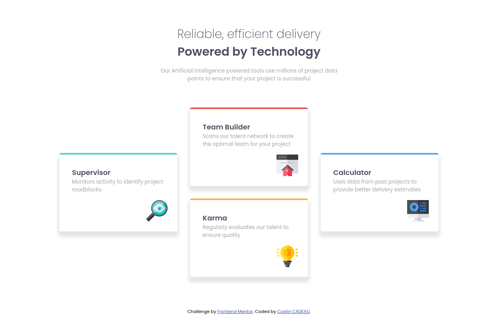

# Frontend Mentor - Four card feature section solution

This is a solution to the [Four card feature section challenge on Frontend Mentor](https://www.frontendmentor.io/challenges/four-card-feature-section-weK1eFYK). Frontend Mentor challenges help you improve your coding skills by building realistic projects. 

## Table of contents

- [Overview](#overview)
  - [The challenge](#the-challenge)
  - [Screenshot](#screenshot)
  - [Links](#links)
- [My process](#my-process)
  - [Built with](#built-with)
  - [What I learned](#what-i-learned)
  - [Useful resources](#useful-resources)
- [Author](#author)

## Overview

### The challenge

Users should be able to:

- View the optimal layout for the site depending on their device's screen size

### Screenshot



### Links

- Source : [Four card feature section challenge on Frontend Mentor](https://www.frontendmentor.io/challenges/four-card-feature-section-weK1eFYK)
- Solution URL: [Add solution URL here](https://your-solution-url.com)
- Live Site URL: [Add live site URL here](https://your-live-site-url.com)

## My process

### Built with

- Semantic HTML5 markup
- CSS custom properties
- Flexbox
- CSS Grid
- Mobile-first workflow

### What I learned

*Grid creation :*
```css
.grid {
        max-width: 968px;
        grid-template-columns: repeat(3, 1fr)
    }
```
*Grid managements :*
```css
.first {
        grid-column: 1;
        grid-row: 1/3;
    }
```
```css
.four {
        grid-column: 3;
        grid-row: 1/3;
    }
```

### Useful resources

- [MDN Web Docs - Grid](https://developer.mozilla.org/fr/docs/Web/CSS/grid) - I has using MDN Web docs, for learn and use CSS Grid.

## Author

- Website - [Add your name here](https://www.your-site.com)
- GitHub - [@c-costin](https://github.com/c-costin)
- Frontend Mentor - [@c-costin](https://www.frontendmentor.io/profile/c-costin)
- Twitter - [@yourusername](https://www.twitter.com/yourusername)


